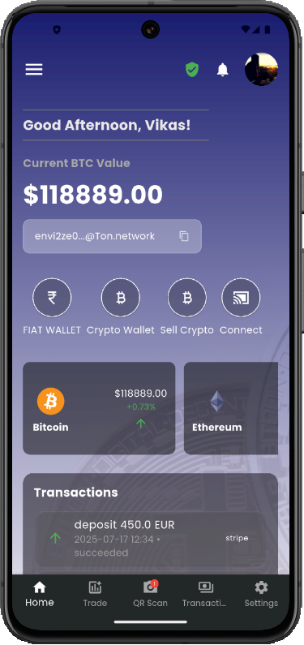
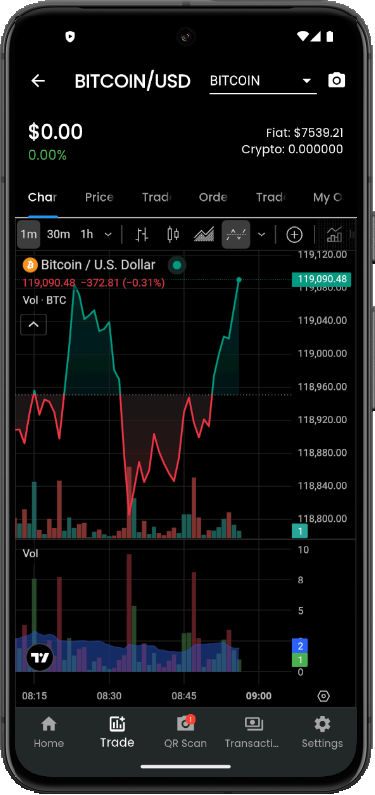
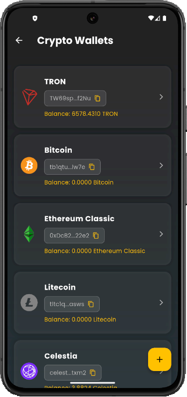
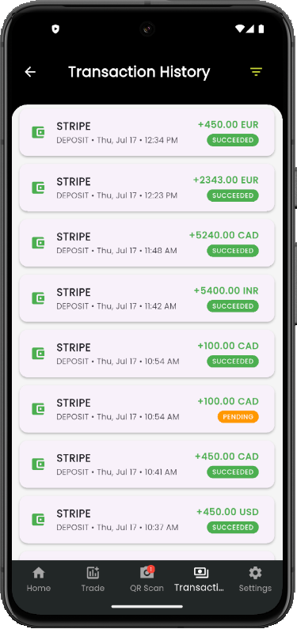
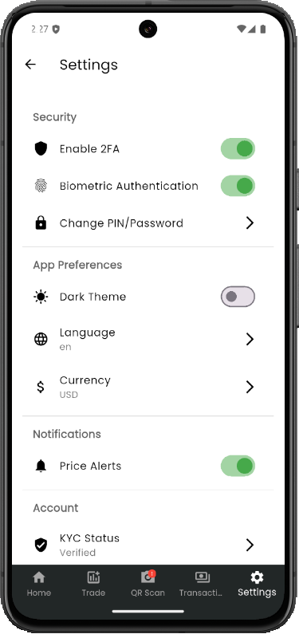
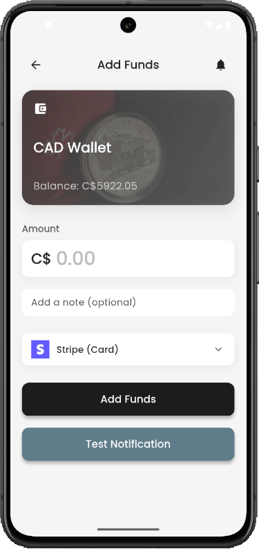

# 🪙 CoinCraze - Your All-in-One Crypto Platform

**CoinCraze** is your complete solution for trading, buying, and securely storing cryptocurrencies.  
Create your wallet and start your crypto journey today! 🚀

🌐 **Live Demo**: [CoinCraze App](https://vikas-web.github.io/CoinCrazeLandingPage/)  
📱 **Built With Flutter (Frontend) + Node.js (Backend) + MongoDB (Database)**

---

## 📸 Screenshots

<div align="center">
  
  
</div>

<div align="center">
  
  
</div>

<div align="center">
  
  
</div>

<div align="center">
  
  
</div>

---

## 🧱 Tech Stack

| Layer       | Tech             |
|-------------|------------------|
| Frontend    | Flutter (Dart)   |
| Backend     | Node.js + Express.js |
| Database    | MongoDB (Mongoose) |
| Auth        | JWT (Token-Based Auth) |
| APIs        | CoinGecko/CoinMarketCap (if used) |
| Deployment  | [Optional] Render / Firebase / Vercel / Heroku |

---

## ⚙️ Features

- 🔐 Secure User Authentication (JWT)
- 🧾 Wallet Creation & Management
- 📈 Real-time Crypto Prices & Charts
- 💱 Buy/Sell Functionality (Demo/Real)
- 🧠 Smart UI built with Flutter
- 📱 100% Responsive Mobile App UI
- 📊 Portfolio Tracking
- 🔧 Backend APIs with Node.js

---

## 📦 Installation & Setup

### 🧩 Prerequisites
- Flutter SDK
- Node.js (v18+)
- MongoDB (local or cloud like MongoDB Atlas)

---

### 🚀 Backend Setup (`/server`)

```bash
cd server
npm install
# Configure .env
npm run dev
